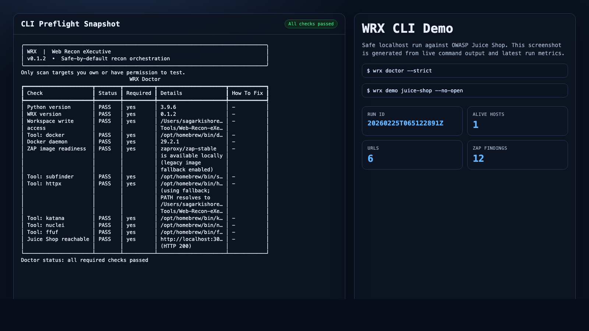
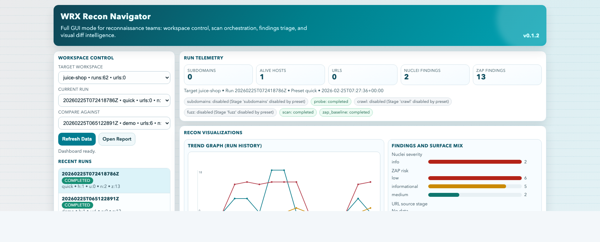

# Web Recon eXecutive (`wrx`)

`wrx` is a safe-by-default web recon orchestrator that unifies common tooling into one reproducible CLI workflow.

## Legal + Safety

Only scan targets you own or have explicit permission to test.

The public demo in this repository is localhost-only and targets OWASP Juice Shop at `http://localhost:3000`.

## Quickstart: Local Juice Shop Demo (Safe)

1. Start Juice Shop:

```bash
docker run --rm -d -p 3000:3000 --name juice-shop bkimminich/juice-shop
```

2. Install `wrx`:

```bash
pipx install -e .
```

Alternative local install:

```bash
python3 -m venv .venv
. .venv/bin/activate
pip install -e '.[dev]'
```

3. Run preflight checks:

```bash
wrx doctor
```

4. Run the full local demo:

```bash
wrx demo juice-shop
```

5. Open report manually (if using `--no-open`):

```bash
open workspaces/juice-shop/report.html
```

6. Launch interactive GUI:

```bash
wrx gui --target juice-shop
```

7. Use GUI Action Center (no CLI required after this):
- set `Action = demo`
- keep `Target = juice-shop`
- click `Run Action`
- watch logs in the Jobs panel and open the generated report

## First-Time User Path (Demo Only)

For first use, stay on the safe, local path only:

- use only `wrx doctor` and `wrx demo juice-shop`
- in GUI, use only `Action = demo` until you are comfortable
- keep target fixed to `juice-shop` (`http://localhost:3000`)
- do not run real internet domains from this onboarding flow

When you are ready, move to `quick`, `bounty`, `deep`, and `flow`.

Makefile shortcuts:

```bash
make install
make demo        # dry-run
DEMO=1 make demo # real run
make first-time  # one-command real local onboarding flow
make gui
make export EXPORT_FORMAT=sarif TARGET=juice-shop
```

## End-to-End Preset Flow (demo, quick, bounty, deep)

Run the full preset tour against local Juice Shop:

```bash
wrx flow juice-shop --no-open
```

This executes `demo -> quick -> bounty -> deep` sequentially in one workspace with localhost-safe overrides:

- `seed_hosts` pinned to `http://localhost:3000`
- `subdomains` disabled for local target
- passive ZAP baseline enabled
- `nuclei` disabled by default in `flow` to keep turnaround reliable

If you want to include nuclei in quick/bounty/deep during flow:

```bash
wrx flow juice-shop --with-scan --no-open
```

In local demo mode, WRX keeps nuclei bounded by scanning alive hosts (not every crawled URL), so `quick`, `bounty`, and `deep` remain reproducible on a laptop.

Makefile shortcuts:

```bash
make flow
make flow-scan
```

You can also run any preset individually in local-demo mode:

```bash
wrx run juice-shop --preset bounty --local-demo --force
wrx run juice-shop --preset deep --local-demo --with-scan --force
```

## Demo with Findings (ZAP Baseline)

Juice Shop primarily demonstrates app-logic vulnerabilities, so template-based scanners like Nuclei can legitimately show zero findings.

To make the local demo reliably produce findings, `wrx demo juice-shop` enables an additional passive OWASP ZAP baseline stage (`zap_baseline`) through Docker.

- Passive only (no active/destructive scan)
- Localhost-only enforcement in demo flow
- Off by default for non-demo presets
- Demo preset keeps `fuzz` and `nuclei` scan off by default to reduce local noise and runtime

### Screenshots

CLI onboarding sample (`doctor` + demo metrics):



GUI dashboard sample (latest run with Nuclei + ZAP):



Report sample (ZAP findings summary):


### Sample Demo Artifacts

- `examples/juice-shop-demo/summary.json`
- `examples/juice-shop-demo/zap.json`
- `examples/juice-shop-demo/diff.json`
- `examples/juice-shop-demo/report.html`
- `examples/juice-shop-demo/cli-screenshot.png`
- `examples/juice-shop-demo/gui-screenshot.png`
- `examples/juice-shop-demo/report-screenshot.png`
- `examples/juice-shop-demo/flow-summary.json`
- `examples/juice-shop-demo/presets/demo-summary.json`
- `examples/juice-shop-demo/presets/quick-summary.json`
- `examples/juice-shop-demo/presets/bounty-summary.json`
- `examples/juice-shop-demo/presets/deep-summary.json`

Look at:
- `counts.zap_findings`
- `zap_findings[]`
- `metadata.artifact_paths.zap_json` and `metadata.artifact_paths.zap_html`
- `summary.json` is a scan-enabled local sample (`quick --local-demo --with-scan`) to show both nuclei and ZAP fields

Flow validation snapshot is tracked in `examples/juice-shop-demo/flow-summary.json`.
It includes:
- `runs[]` for `demo`, `quick`, `bounty`, `deep`
- `scan_enabled_example` for `quick --local-demo --with-scan`

## Interactive GUI (Production-Oriented)

`wrx gui` launches a full recon control plane for users who prefer GUI over CLI.

```bash
wrx gui --target juice-shop
```

Options:

- `--host` and `--port` to bind on a custom interface
- `--target` to preselect a workspace
- `--no-open` to avoid auto-opening the browser
- `--dry-run` to print launch details only

Dashboard highlights:

- workspace/run selectors with recent run timeline
- GUI Action Center to run `init`, `run`, `doctor`, `report`, `diff`, `demo`, and `flow`
- asynchronous job monitor with live logs + cancel support
- persistent SQLite-backed job history across GUI restarts
- run telemetry cards and stage pipeline status pills
- trend graph for URLs/Nuclei/ZAP across run history
- historical drift table (surface/findings deltas between runs)
- preset trend rollups (coverage averages by preset)
- stage health matrix (multi-run stage outcomes)
- finding and surface distributions (severity/risk/source-stage bars)
- technology profile cloud from live host fingerprints
- asset correlation graph (host/url/tech/nuclei/zap) with filtering and click-through drilldowns
- findings explorer (Nuclei/ZAP tabs + live filtering)
- triage assistant panel (cluster recommendations + optional Ollama summary)
- creative diff studio with impact cards, ratio bars, and expandable add/remove lists

## Features

- Unified pipeline: `subdomains -> probe -> crawl -> fuzz -> scan -> zap_baseline -> report`
- Normalized JSON outputs + run history + diffing
- Safe demo mode with localhost-only constraints
- Rich terminal UX + static HTML reporting
- Interactive GUI for run navigation, findings filtering, graph/drift analysis, and visual diffs
- Context-aware ffuf wordlists generated from discovered URLs/routes
- Scan profile management (`safe`, `balanced`, `deep`) for nuclei/zap defaults
- Optional local-first triage with Ollama integration (`--triage`, `--ollama`)
- Export connectors: Markdown, SARIF, GitHub issue payloads, Jira issue payloads

## Core Commands

- `wrx init <target>`
- `wrx run <target> --preset <name> [--concurrency N] [--force] [--dry-run]`
- `wrx diff <target> [--last N]`
- `wrx report <target>`
- `wrx export <target> --format markdown|sarif|github|jira [--run-id <id>]`
- `wrx doctor [--strict]`
- `wrx demo juice-shop [--dry-run] [--no-open] [--keep-running]`
- `wrx flow juice-shop [--dry-run] [--with-scan] [--no-open]`
- `wrx gui [--target <workspace>] [--host 127.0.0.1] [--port 8787] [--no-open]`

GUI note:
- Everything above can be operated from the GUI Action Center, so teams can use WRX without CLI knowledge.

## Presets and Config

Default presets include `demo`, `quick`, `bounty`, and `deep`.

Scan profiles include `safe`, `balanced`, and `deep` and control nuclei/zap defaults (rate limits, timeouts, severities/tags, baseline depth).
You can override per run:

```bash
wrx run juice-shop --preset bounty --scan-profile balanced
wrx run juice-shop --preset deep --scan-profile deep
```

Optional triage modes:

```bash
wrx run juice-shop --preset quick --triage
wrx run juice-shop --preset quick --triage --ollama --ollama-model qwen2.5:7b
```

Exports:

```bash
wrx export juice-shop --format markdown
wrx export juice-shop --format sarif
wrx export juice-shop --format github
wrx export juice-shop --format jira --jira-project SEC
```

`demo` preset highlights:

- `seed_hosts: ["http://localhost:3000"]`
- `subdomains: false`
- `fuzz: false`
- `scan: false` (nuclei disabled in demo preset)
- `zap_baseline: true`
- conservative crawl/zap timeouts and args

Reference config: `examples/wrx.sample.yaml`

## External Tools

Optional integrations (stages skip gracefully if missing):

- `subfinder`
- `httpx`
- `katana`
- `ffuf`
- `nuclei`
- `docker` (required for `zap_baseline`)

### Tooling Note: `httpx` Name Clash

`pip install httpx` (Python library) installs a different CLI named `httpx`, which can shadow ProjectDiscovery `httpx` in virtual environments.

WRX auto-detects and prefers the ProjectDiscovery binary, and `wrx doctor` reports when a fallback path is used.

To avoid ambiguity, place ProjectDiscovery `httpx` ahead of virtualenv scripts in your shell `PATH`.

## Workspace Layout

```text
workspaces/
  juice-shop/
    wrx.yaml
    current_run.txt
    report.html
    raw/
      probe/
      crawl/
      scan/
      zap_baseline/
        zap.json
        zap.html
        logs.txt
    data/
      summary.json
      diff.json
      zap_baseline.json
      # optional triage payload inside summary.json
    runs/<run_id>/...
```

## Normalized Summary Schema

`summary.json` includes:

- `metadata`
  - `target`, `timestamp`, `preset`, `run_id`
  - `tool_versions`
  - `artifact_paths` (includes ZAP raw report paths)
- `subdomains`
- `alive_hosts`
- `urls`
- `nuclei_findings`
- `zap_findings`
- `triage` (when enabled)
- `counts` (includes `zap_findings`)

## Automation + CI

- `make install`
- `make lint`
- `make test`
- `make demo` (doctor + dry-run by default)
- `DEMO=1 make demo` (real local demo)
- `make flow` (full preset tour on local Juice Shop)
- `FLOW_DRY=1 make flow` (dry-run preset tour)
- `make gui` (launch interactive dashboard for Juice Shop workspace)

GitHub Actions: `.github/workflows/ci.yml`

- Python 3.11 + 3.12
- `ruff check .`
- `pytest -q`
- No Docker requirement in CI

## Development

Fixtures used by parser/tests live in `examples/fixtures/`.

To add a stage:

1. Add module in `wrx/stages/`
2. Add parser in `wrx/normalize/` if needed
3. Wire stage in `wrx/runner.py`
4. Expose config/preset toggles in `wrx/config.py`
5. Add tests in `tests/`

## Recommended Next Features

1. Asset ownership + scope policy engine
Add explicit in-scope/out-of-scope policies and enforce them across CLI and GUI actions.

2. Graph snapshots and diff overlays
Persist graph snapshots per run and visualize node/edge changes over time.

3. SARIF/Jira direct push mode
Add authenticated push commands (not only JSON payload export).

4. Team workflows
Add saved views, analyst notes, and assignment status per finding cluster.
